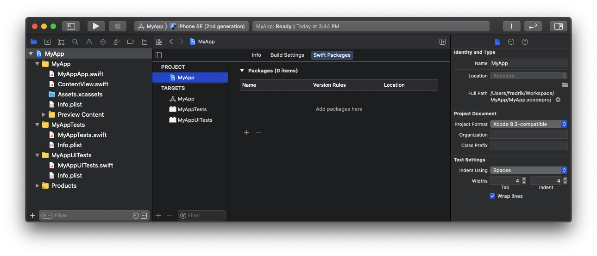
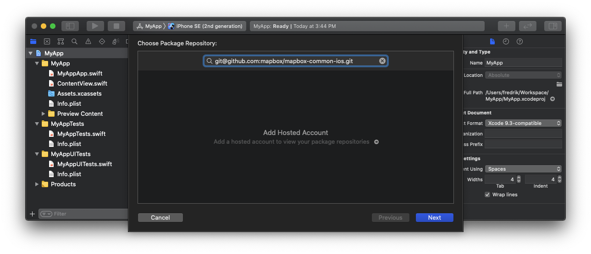
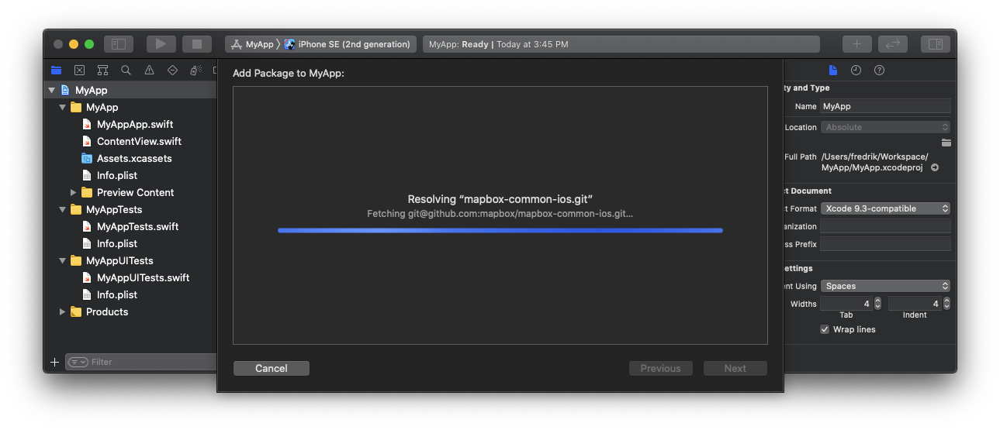
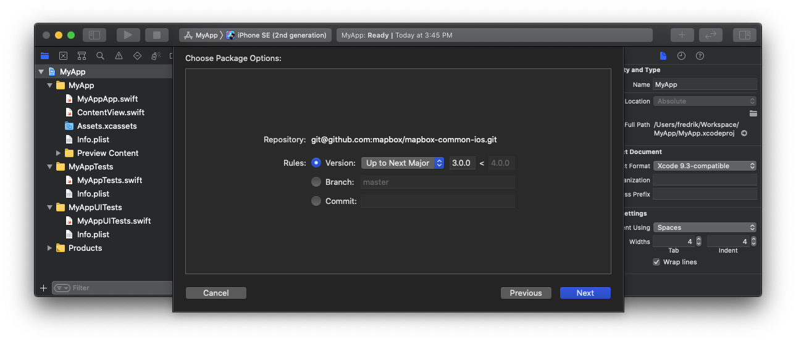

# mapbox-common-ios

MapboxCommon provides common functionality among all Mapbox SDKs including:

* [Maps](https://github.com/mapbox/mapbox-maps-ios)
* [Navigation](https://github.com/mapbox/mapbox-navigation-ios)
* [Search](https://github.com/mapbox/search-ios)

To learn more about these SDKs please visit their repos on GitHub and the documentation at https://docs.mapbox.com/.

### Prerequisites

Before you can download the Mapbox Common SDK, you need to create a token with `DOWNLOAD:READ` scope.
Go to https://account.mapbox.com and click "Create token"

##### SPM, CocoaPods and Carthage
Insert or append the following to `~/.netrc`

```bash
machine api.mapbox.com
  login mapbox
  password <TOKEN WITH DOWNLOAD:READ SCOPE>
```

## Integration

##### Swift Package Manager

###### Using Xcode

<details><summary>Detailed Flow</summary>




</details>

###### Using SPM Package 📱🖥💻

```swift
.package(url: "https://github.com/mapbox/mapbox-common-ios.git", from: "23.11.2"),
```

##### CocoaPods 📱🖥💻

```ruby
pod 'MapboxCommon', '23.11.2'
```

##### Carthage 📱

Add the following code to your Cartfile.

```bash
binary "https://api.mapbox.com/downloads/v2/carthage/mapbox-common/MapboxCommon.json" == 23.11.2
```

Then run the following command in the Terminal.
```bash
carthage update --platform ios --use-netrc
```
